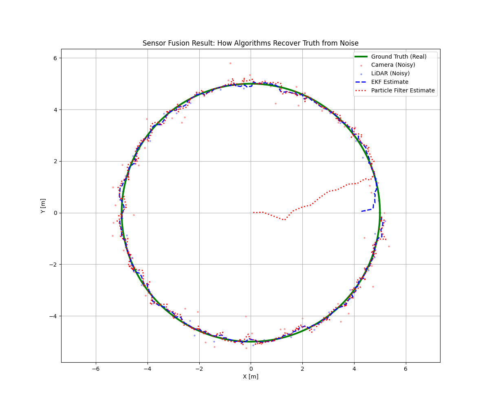

# Multimodal Sensor Fusion for Autonomous State Estimation

## 📌 Overview
This project implements a robust **Multimodal Sensor Fusion System** that estimates an autonomous agent's state in real-time. By integrating disparate data sources—**Vision (Landmark-based), LiDAR (Scan-matching), and IMU (Inertial)—**the system demonstrates how probabilistic models overcome the inherent limitations and noise of individual sensors.

## 📊 Key Visual Results

### 1. Modeling Reality: Sensor Noise Simulation
Individual sensors are rarely perfect. As shown below, the raw camera observations (red dots) contain significant Gaussian noise, deviating from the ideal green trajectory. This simulation reflects real-world challenges such as motion blur and environmental interference.


### 2. The Power of Fusion: EKF & Particle Filter
The core of this project is the recovery of the "Ground Truth" from noisy inputs. 
- **EKF (Blue dashed line)**: Provides a smooth, mathematically optimized path by linearizing the motion model.
- **Particle Filter (Red dotted line)**: Demonstrates the ability to handle non-linearities and recover from initial uncertainty (as seen in the convergence phase at the center of the plot).



## 🚀 Technical Deep Dive

### 1. Mathematical Modeling
- **Non-Linear Estimation**: Used Jacobian matrices to adapt the Kalman Filter for circular kinematics.
- **Monte Carlo Sampling**: Implemented importance resampling in the Particle Filter to maintain a high-confidence hypothesis of the robot's position.

### 2. Multimodal Synergy
- **IMU**: Provides high-frequency motion cues for prediction.
- **Vision/LiDAR**: Acts as a global anchor to correct the cumulative drift from inertial sensors.

## 🛠 System Architecture
- `sensors/`: Vision (AprilTag simulation), LiDAR (ICP-logic), and IMU (integration).
- `fusion/`: Core logic for EKF and Particle Filter.
- `utils/`: Trajectory generation and visualization engine.

## 💡 Engineering Insights
This project demonstrates the fundamental principle of **State Estimation**: *Confidence is not about having a perfect sensor, but about knowing how to weigh imperfect ones.* The results show that while individual sensor data might be unreliable, the fusion of multiple modalities ensures a safe and accurate "world view" for autonomous agents.

---
## How to Run
```bash
python main.py